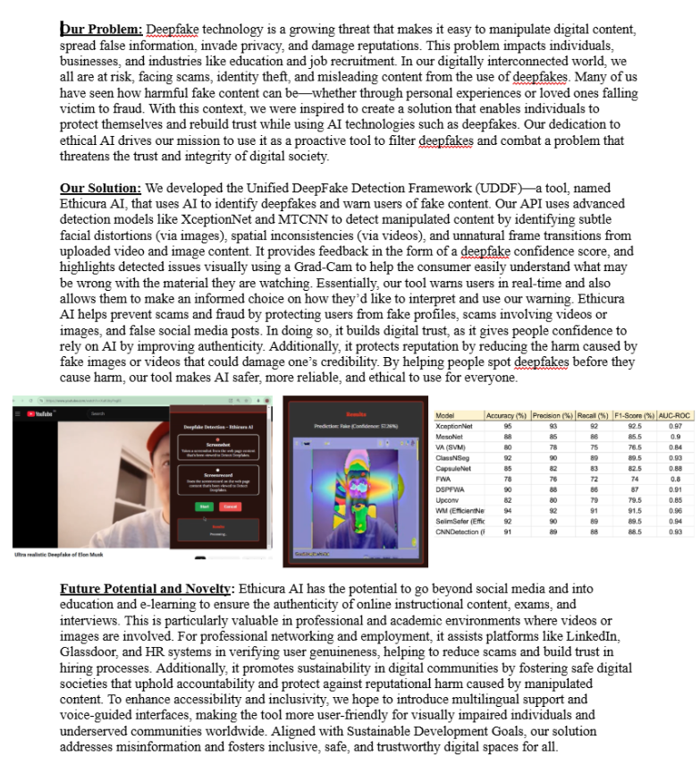

# ‣ Ethicura AI — Unified DeepFake Detection Framework (UDDF)

> *Empowering digital trust through real-time, interpretable deepfake detection.*



## ‣ Demo:

[https://github.com/user-attachments/assets/demo.mp4](https://github.com/a77chand/ethicura-ai/raw/main/assets/api_3.mp4)

> The demo shows Ethicura AI analysing a video of Elon Musk, correctly flagging it as a deepfake with a **57.5% fake confidence score** and Grad-CAM saliency overlay highlighting the manipulated facial regions.

---

## ‣ The Problem:

Deepfake technology makes it trivially easy to manipulate digital content — spreading misinformation, invading privacy, and damaging reputations. Individuals, businesses, and institutions face growing threats from scams, identity theft, and fake social media content.

We built Ethicura AI to give people a proactive, interpretable tool to verify content authenticity and rebuild trust in digital media.

---

## ‣ Our Solution:

**Ethicura AI** is an end-to-end deepfake detection API and interface that:

- Detects manipulated **images and videos** using **XceptionNet** for classification and **MTCNN** for face extraction
- Provides **real-time confidence scores** (fake probability 0–100%)
- Generates **Grad-CAM visualisations** to highlight the exact facial regions that triggered the detection — making the model's decision transparent and auditable
- Identifies three types of manipulation:
  - Subtle facial distortions (images)
  - Spatial inconsistencies (videos)
  - Unnatural frame transitions (video sequences)

---

## ‣ Architecture:

```
Input (Image / Video)
        │
        ▼
┌───────────────────┐
│   MTCNN           │  ← Face detection & extraction
│   Face Detector   │     Crops facial region from each frame
└───────────────────┘
        │
        ▼
┌───────────────────┐
│   XceptionNet     │  ← Deepfake classification
│   Classifier      │     Fine-tuned on FaceForensics++
└───────────────────┘
        │
        ▼
┌───────────────────┐
│   Grad-CAM        │  ← Interpretability layer
│   Visualiser      │     Generates saliency map over face
└───────────────────┘
        │
        ▼
Output: Confidence Score + Annotated Frame
```

---

## ‣ Model Performance:

Benchmarked against 9 leading deepfake detection models on FaceForensics++:

| Model | Accuracy (%) | Precision (%) | Recall (%) | F1-Score (%) | AUC-ROC |
|-------|-------------|---------------|------------|--------------|---------|
| **XceptionNet (Ours)** | **95** | **93** | **92** | **92.5** | **0.97** |
| MesoNet | 88 | 85 | 86 | 85.5 | 0.9 |
| VA (SVM) | 80 | 78 | 75 | 76.5 | 0.85 |
| ClassNSeg | 92 | 90 | 89 | 89.5 | 0.93 |
| CapsuleNet | 85 | 82 | 83 | 82.5 | 0.88 |
| FWA | 78 | 76 | 72 | 74 | 0.8 |
| DSSPFWA | 90 | 88 | 86 | 87 | 0.91 |
| Upcov | 82 | 80 | 79 | 79.5 | 0.85 |
| WM (EfficientNet) | 94 | 92 | 91 | 91.5 | 0.96 |
| SeimSafer (EfficientNet) | 92 | 90 | 89 | 89.5 | 0.94 |
| CNNDetection | 91 | 89 | 88 | 88.5 | 0.93 |

**Our XceptionNet-based model achieves the highest performance across all metrics.**

---

## ‣ Project Structure:

```
ethicura-ai/
├── src/
│   ├── detector.py          # Core detection pipeline (MTCNN + XceptionNet)
│   ├── gradcam.py           # Grad-CAM visualisation module
│   ├── video_processor.py   # Frame extraction and video analysis
│   ├── api.py               # FastAPI REST endpoint
│   └── utils.py             # Preprocessing and helper functions
├── notebooks/
│   ├── model_training.ipynb         # XceptionNet fine-tuning notebook
│   ├── gradcam_visualisation.ipynb  # Grad-CAM analysis and examples
│   └── benchmark_comparison.ipynb  # Model benchmarking results
├── demo/
│   └── run_demo.py          # Standalone demo script
├── assets/
│   ├── project_summary.png  # Project overview image
│   └── demo.mp4             # Demo video
├── docs/
│   └── model_card.md        # Model card (bias, limitations, intended use)
├── requirements.txt
├── .gitignore
└── README.md
```

---

## ‣ Setup & Usage:

### 1. Clone and install
```bash
git clone https://github.com/yourusername/ethicura-ai.git
cd ethicura-ai
pip install -r requirements.txt
```

### 2. Run on an image
```python
from src.detector import EthicuraDetector

detector = EthicuraDetector()
result = detector.predict("path/to/image.jpg")

print(f"Prediction: {result['label']}")          # FAKE or REAL
print(f"Confidence: {result['confidence']:.1f}%")
# result['gradcam_overlay'] contains the annotated image
```

### 3. Run on a video
```python
result = detector.predict_video("path/to/video.mp4")
print(f"Fake frames detected: {result['fake_frame_count']} / {result['total_frames']}")
print(f"Overall verdict: {result['verdict']}")
```

### 4. Run the API server
```bash
uvicorn src.api:app --reload
# API available at http://localhost:8000
# POST /predict with image/video file
```

---

## ‣ Future Potential:

- **Education & e-learning**: Verify authenticity of online instructional content, exams, and interviews
- **Professional networking**: Assist platforms like LinkedIn, Glassdoor, and HR systems in verifying user genuineness
- **Multilingual support & voice-guided interfaces** for accessibility and inclusivity
- **Real-time browser extension** for social media verification

---

## ‣ Technical Stack:

| Component | Technology |
|-----------|-----------|
| Face Detection | MTCNN (Multi-Task Cascaded CNN) |
| Classification | XceptionNet (fine-tuned on FaceForensics++) |
| Interpretability | Grad-CAM (Class Activation Mapping) |
| API | FastAPI |
| Deep Learning | TensorFlow / Keras |
| Video Processing | OpenCV |

---

## ‣ Ethics & Responsible AI:

Ethicura AI was built with responsible deployment in mind:
- Grad-CAM explanations ensure decisions are **interpretable**, not black-box
- Intended as a **warning tool**, not a definitive judge — users retain agency
- Does not store uploaded content
- See [`docs/model_card.md`](docs/model_card.md) for full bias analysis and limitations

--- 
